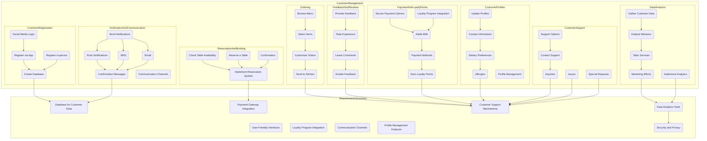

# restaurantApp
Restaurant management app

1. Top Level Modules
2. Customer module
3. Orders module
4. Inventory module

Work in progress Dont look below this line :) 

```mermaid
graph TD
    subgraph CustomerManagement
        subgraph CustomerRegistration
            A(Register via App)
            B(Register in-person)
            C(Create Database)
            D(Social Media Login)
        end
        subgraph ReservationAndBooking
            E(Check Table Availability)
            F(Reserve a Table)
            G(Confirmation)
            H(Implement Reservation System)
        end
        subgraph Ordering
            I(Browse Menu)
            J(Select Items)
            K(Customize Orders)
            L(Send to Kitchen)
        end
        subgraph FeedbackAndReviews
            M(Provide Feedback)
            N(Rate Experience)
            O(Leave Comments)
            P(Enable Feedback)
        end
        subgraph PaymentAndLoyaltyPoints
            Q(Settle Bills)
            R(Payment Methods)
            S(Earn Loyalty Points)
            T(Secure Payment Options)
            U(Loyalty Program Integration)
        end
        subgraph NotificationAndCommunication
            V(Send Notifications)
            W(Push Notifications)
            X(SMS)
            Y(Email)
            Z(Confirmation Messages)
            AA(Communication Channels)
        end
        subgraph CustomerProfiles
            AB(Update Profiles)
            AC(Contact Information)
            AD(Dietary Preferences)
            AE(Allergies)
            AF(Profile Management)
        end
        subgraph CustomerSupport
            AG(Contact Support)
            AH(Inquiries)
            AI(Issues)
            AJ(Special Requests)
            AK(Support Options)
        end
        subgraph DataAnalytics
            AL(Gather Customer Data)
            AM(Analyze Behavior)
            AN(Tailor Services)
            AO(Marketing Efforts)
            AP(Implement Analytics)
        end
    end

    subgraph RequirementsSummary
        BA(Database for Customer Data)
        BB(User-Friendly Interfaces)
        BC(Payment Gateway Integration)
        BD(Loyalty Program Integration)
        BE(Communication Channels)
        BF(Profile Management Features)
        BG(Customer Support Mechanisms)
        BH(Data Analytics Tools)
        BI(Security and Privacy)
    end

    A --> C
    B --> C
    C --> BA
    D --> A
    E --> H
    F --> H
    G --> H
    H --> BC
    I --> J
    J --> K
    K --> L
    L --> BG
    M --> N
    N --> O
    O --> P
    P --> BG
    Q --> R
    R --> S
    S --> BG
    T --> Q
    U --> Q
    V --> W
    V --> X
    V --> Y
    W --> Z
    X --> Z
    Y --> Z
    Z --> BA
    AB --> AC
    AC --> AD
    AD --> AE
    AE --> BG
    AG --> AH
    AH --> BG
    AI --> BG
    AJ --> BG
    AK --> AG
    AL --> AM
    AM --> AN
    AN --> AO
    AO --> BH
    AP --> BH
    BH --> BI

```
