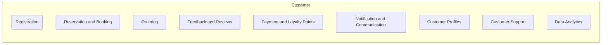

# Customer modules high level requirements
Customer Module Requirements

1. **Customer Registration:**
   - **Explanation:** Provide a user-friendly registration process for customers to create accounts within the app. Collect essential information, such as name, email, phone number, and allow optional social media login for convenience.

2. **Reservation and Booking:**
   - **Explanation:** Implement a reservation system that allows customers to book tables for specific dates and times. Provide real-time availability status and confirmation notifications.

3. **Ordering:**
   - **Explanation:** Enable customers to browse the restaurant's menu, select items, customize orders (e.g., special instructions, dietary preferences), and place orders for dine-in or takeout.

4. **Feedback and Reviews:**
   - **Explanation:** Allow customers to share their feedback and rate their dining experiences. Provide a platform for leaving detailed reviews, which can help improve service quality.

5. **Payment and Loyalty Points:**
   - **Explanation:** Offer secure payment options (credit/debit cards, mobile wallets) for settling bills. Integrate a loyalty program to reward customers with points or discounts based on their purchases.

6. **Notification and Communication:**
   - **Explanation:** Establish communication channels to send reservation confirmations, order updates, promotions, and other important information via push notifications, SMS, or email.

7. **Customer Profiles:**
   - **Explanation:** Develop a user profile management system that allows customers to update their contact information, dietary preferences, allergies, and other details for a personalized experience.

8. **Customer Support:**
   - **Explanation:** Provide customer support options (live chat, phone, email) for inquiries, addressing issues, or handling special requests. Ensure efficient and timely assistance for customer concerns.

9. **Data Analytics:**
   - **Explanation:** Implement analytics tools to gather and analyze customer behavior and preferences. Use this data to tailor services, marketing efforts, and menu offerings to customer preferences.
