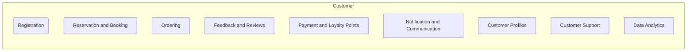

# Customer modules high level requirements
Customer Module Requirements

DB Schema

**Customers Table:**

| Field             | Type         | Description                      |
|-------------------|--------------|----------------------------------|
| customer_id       | Primary Key  | Unique customer identifier       |
| first_name        | VARCHAR(50)  | First name of the customer       |
| last_name         | VARCHAR(50)  | Last name of the customer        |
| email             | VARCHAR(100) | Customer's email address         |
| phone_number      | VARCHAR(20)  | Customer's phone number          |
| date_of_birth     | DATE         | Customer's date of birth         |
| registration_date | DATE         | Date when the customer registered |
| last_login_date   | DATE         | Date of the customer's last login|

**Addresses Table:**

| Field           | Type         | Description                               |
|-----------------|--------------|-------------------------------------------|
| address_id     | Primary Key  | Unique address identifier                  |
| customer_id    | Foreign Key  | Reference to the customer who owns this address |
| street_address | VARCHAR(100) | Street address                            |
| city           | VARCHAR(50)  | City                                      |
| state          | VARCHAR(50)  | State or province                         |
| postal_code    | VARCHAR(20)  | Postal code or ZIP code                   |
| country        | VARCHAR(50)  | Country                                   |

**Preferences Table:**

| Field              | Type         | Description                    |
|--------------------|--------------|--------------------------------|
| preference_id     | Primary Key  | Unique preference identifier   |
| customer_id      | Foreign Key  | Reference to the customer      |
| dietary_preferences | VARCHAR(255) | Customer's dietary preferences |
| allergies          | VARCHAR(255) | Customer's allergies          |
| favorite_cuisine   | VARCHAR(50)  | Customer's favorite cuisine   |

**Orders Table:**

| Field          | Type         | Description                                   |
|----------------|--------------|-----------------------------------------------|
| order_id     | Primary Key  | Unique order identifier                       |
| customer_id  | Foreign Key  | Reference to the customer who placed the order |
| order_date   | DATE         | Date when the order was placed                |
| total_amount | DECIMAL(10, 2) | Total amount of the order                     |
| status       | VARCHAR(20)  | Order status (e.g., pending, delivered)       |

**Reviews Table:**

| Field      | Type         | Description                                 |
|------------|--------------|---------------------------------------------|
| review_id | Primary Key  | Unique review identifier                    |
| customer_id | Foreign Key  | Reference to the customer who left the review |
| order_id   | Foreign Key  | Reference to the order being reviewed       |
| rating     | INT          | Rating given by the customer (e.g., 1 to 5) |
| comment    | TEXT         | Customer's comments or review text          |
| review_date | DATE        | Date when the review was posted              |

**Loyalty Points Table:**

| Field           | Type         | Description                            |
|-----------------|--------------|----------------------------------------|
| loyalty_id     | Primary Key  | Unique loyalty points identifier       |
| customer_id    | Foreign Key  | Reference to the customer              |
| points_earned  | INT          | Points earned by the customer         |
| points_used    | INT          | Points used by the customer           |
| points_balance | INT          | Current points balance for the customer|

Detailed Requirement explanation

1. **Customer Registration:**
   - **Explanation:** Provide a user-friendly registration process for customers to create accounts within the app. Collect essential information, such as name, email, phone number, and allow optional social media login for convenience.

2. **Reservation and Booking:**
   - **Explanation:** Implement a reservation system that allows customers to book tables for specific dates and times. Provide real-time availability status and confirmation notifications.

3. **Ordering:**
   - **Explanation:** Enable customers to browse the restaurant's menu, select items, customize orders (e.g., special instructions, dietary preferences), and place orders for dine-in or takeout.

4. **Feedback and Reviews:**
   - **Explanation:** Allow customers to share their feedback and rate their dining experiences. Provide a platform for leaving detailed reviews, which can help improve service quality.

5. **Payment and Loyalty Points:**
   - **Explanation:** Offer secure payment options (credit/debit cards, mobile wallets) for settling bills. Integrate a loyalty program to reward customers with points or discounts based on their purchases.

6. **Notification and Communication:**
   - **Explanation:** Establish communication channels to send reservation confirmations, order updates, promotions, and other important information via push notifications, SMS, or email.

7. **Customer Profiles:**
   - **Explanation:** Develop a user profile management system that allows customers to update their contact information, dietary preferences, allergies, and other details for a personalized experience.

8. **Customer Support:**
   - **Explanation:** Provide customer support options (live chat, phone, email) for inquiries, addressing issues, or handling special requests. Ensure efficient and timely assistance for customer concerns.

9. **Data Analytics:**
   - **Explanation:** Implement analytics tools to gather and analyze customer behavior and preferences. Use this data to tailor services, marketing efforts, and menu offerings to customer preferences.
