# Restaurant inventory module high level requirements
Inventory module requirements

```mermaid
graph LR
subgraph Inventory_Management
        Inventory_Tracking
        Inventory_Categories
        Item_Details
        Reordering_Thresholds
        Supplier_Management
        Cost_Tracking
        Shelf_Life_and_Expiry_Dates
        Waste_Management
        Inventory_Valuation
        Stock_Rotation
        Barcode_Scanning
        Reporting_and_Analytics
        Integration_with_POS[Integration with Point of Sale]
        Theft_Prevention
        Multi-Location_Support
        User_Permissions
        Mobile_Access
        Auditing_and_Compliance
        Alerts_and_Notifications
        Data_Backup_and_Recovery
    end

```

DB Schema:

**Inventory_Items Table:**

| Field               | Type         | Description                                |
|---------------------|--------------|--------------------------------------------|
| item_id             | Primary Key  | Unique inventory item identifier            |
| name                | VARCHAR(100) | Name of the inventory item                 |
| description         | TEXT         | Description of the inventory item          |
| category            | VARCHAR(50)  | Category or type of inventory item         |
| unit_of_measurement | VARCHAR(20)  | Unit of measurement (e.g., kg, units)      |
| cost_price          | DECIMAL(10, 2) | Cost price per unit                        |
| selling_price       | DECIMAL(10, 2) | Selling price per unit                     |
| current_quantity    | INT          | Current quantity in stock                   |
| reorder_threshold   | INT          | Minimum quantity triggering reorder        |
| supplier_id         | Foreign Key  | Reference to the supplier of the item      |
| shelf_life_days     | INT          | Shelf life of the item in days             |
| expiry_date         | DATE         | Expiry date of the item                    |

**Suppliers Table:**

| Field           | Type         | Description                             |
|-----------------|--------------|-----------------------------------------|
| supplier_id     | Primary Key  | Unique supplier identifier              |
| name            | VARCHAR(100) | Name of the supplier                    |
| contact_name    | VARCHAR(100) | Contact name at the supplier           |
| email           | VARCHAR(100) | Email address of the supplier          |
| phone_number    | VARCHAR(20)  | Phone number of the supplier           |
| address_id      | Foreign Key  | Reference to the supplier's address    |

**Inventory_Transactions Table:**

| Field               | Type         | Description                                   |
|---------------------|--------------|-----------------------------------------------|
| transaction_id      | Primary Key  | Unique inventory transaction identifier      |
| item_id             | Foreign Key  | Reference to the inventory item involved     |
| transaction_date    | DATE         | Date of the inventory transaction             |
| transaction_type    | VARCHAR(20)  | Type of transaction (e.g., purchase, usage)   |
| quantity_change     | INT          | Change in quantity (positive for additions, negative for deductions) |
| unit_price          | DECIMAL(10, 2) | Price per unit                               |
| total_cost          | DECIMAL(10, 2) | Total cost of the transaction               |
| supplier_id         | Foreign Key  | Reference to the supplier for purchases      |
| employee_id         | Foreign Key  | Reference to the employee responsible for the transaction |

**Inventory_Categories Table:**

| Field          | Type         | Description                                   |
|----------------|--------------|-----------------------------------------------|
| category_id    | Primary Key  | Unique category identifier                    |
| category_name  | VARCHAR(50)  | Name of the inventory category                |
| description    | TEXT         | Description of the inventory category         |

**Inventory_Alerts Table:**

| Field             | Type         | Description                                |
|-------------------|--------------|--------------------------------------------|
| alert_id          | Primary Key  | Unique alert identifier                     |
| item_id           | Foreign Key  | Reference to the inventory item            |
| alert_type        | VARCHAR(20)  | Type of alert (e.g., low stock, expired)   |
| alert_description | TEXT         | Description of the alert                   |
| alert_date        | DATE         | Date when the alert was triggered          |

Detailed explanation of requirements

1. **Inventory Tracking:**
   - **Explanation:** Implement a system to track the levels of inventory items in real-time, ensuring accurate and up-to-date information about ingredient and supply availability.

2. **Inventory Categories:**
   - **Explanation:** Organize inventory items into categories (e.g., food items, beverages, kitchen supplies, cleaning supplies) for efficient management and easy access.

3. **Item Details:**
   - **Explanation:** Store comprehensive information for each inventory item, including its name, description, unit of measurement, and supplier details.

4. **Reordering Thresholds:**
   - **Explanation:** Set minimum inventory thresholds for each item to trigger automatic reorder alerts when stock levels fall below predefined levels.

5. **Supplier Management:**
   - **Explanation:** Maintain a list of approved suppliers and vendors, and facilitate the generation of purchase orders or communication with suppliers when inventory needs replenishment.

6. **Cost Tracking:**
   - **Explanation:** Record and track the cost of each inventory item, and calculate the total cost of inventory on hand to help manage expenses effectively.

7. **Shelf Life and Expiry Dates:**
   - **Explanation:** Track the shelf life and expiry dates of perishable items to prevent the use of expired goods and minimize waste.

8. **Waste Management:**
   - **Explanation:** Record and track food wastage to identify areas for waste reduction, cost savings, and improved inventory management.

9. **Inventory Valuation:**
   - **Explanation:** Calculate the current value of the entire inventory based on the costs associated with each item, facilitating financial analysis and decision-making.

10. **Stock Rotation:**
    - **Explanation:** Implement a stock rotation system, such as First-In, First-Out (FIFO) or Last-In, First-Out (LIFO), to ensure that the oldest items are used first to reduce the risk of spoilage and waste.

11. **Barcode Scanning:**
    - **Explanation:** Utilize barcode scanners to streamline inventory checks, updates, and tracking, improving accuracy and efficiency.

12. **Reporting and Analytics:**
    - **Explanation:** Generate reports on inventory levels, usage, and costs, and leverage analytics to make informed purchasing decisions and optimize inventory management strategies.

13. **Integration with Point of Sale (POS):**
    - **Explanation:** Sync inventory levels with the POS system to automatically deduct items from inventory when customer orders are placed, reducing the risk of overcommitting resources.

14. **Theft Prevention:**
    - **Explanation:** Implement security measures and controls to prevent inventory theft, unauthorized access, and ensure the integrity of inventory data.

15. **Multi-Location Support:**
    - **Explanation:** If the restaurant operates multiple locations, support inventory management across all locations, allowing for centralized control and coordination.

16. **User Permissions:**
    - **Explanation:** Assign different levels of access and permissions to staff members based on their roles (e.g., manager, kitchen staff, inventory manager) to maintain data security.

17. **Mobile Access:**
    - **Explanation:** Enable authorized staff to access inventory information and perform updates using mobile devices for flexibility and convenience.

18. **Auditing and Compliance:**
    - **Explanation:** Ensure compliance with food safety and regulatory requirements by maintaining accurate records of inventory transactions, inspections, and compliance checks.

19. **Alerts and Notifications:**
    - **Explanation:** Send alerts and notifications to staff when inventory items require attention, such as low stock levels, expiring items, or critical inventory issues.

20. **Data Backup and Recovery:**
    - **Explanation:** Implement regular data backup procedures to prevent the loss of inventory data and ensure the ability to recover data in case of system failures or data corruption.
