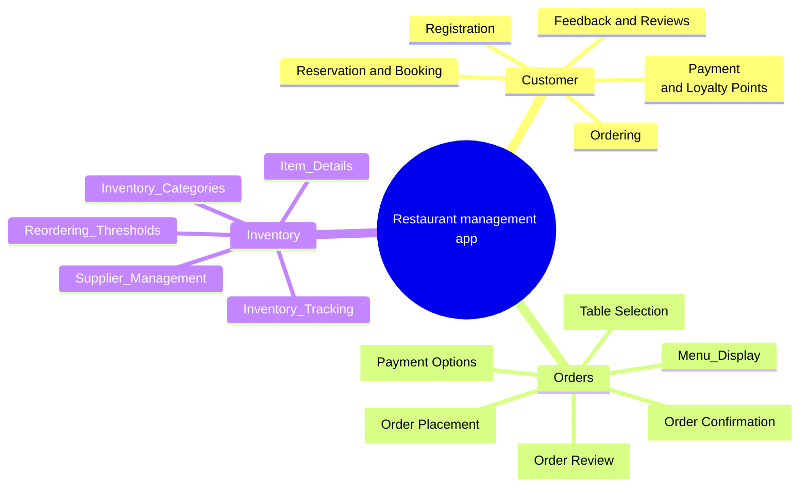

# Top Level Modules
Restaurant management app

```mermaid
mindmap
  root((Restaurant management app))
  ::icon(fas fa-hamburger)
    Customer
    ::icon(fa fa-user) 
      Registration
      Reservation and Booking
      Ordering
      Feedback and Reviews
      Payment <br/>and Loyalty Points
    Orders
    ::icon(fa fa-usd) 
      Menu_Display
      Order_Placement[Order Placement]
      Table_Selection[Table Selection]
      Order_Review[Order Review]
      Order_Confirmation[Order Confirmation]
      Payment_Options[Payment Options]  
    Inventory
    ::icon(fa fa-th-list)
      Inventory_Tracking
      Inventory_Categories
      Item_Details
      Reordering_Thresholds
      Supplier_Management
```
