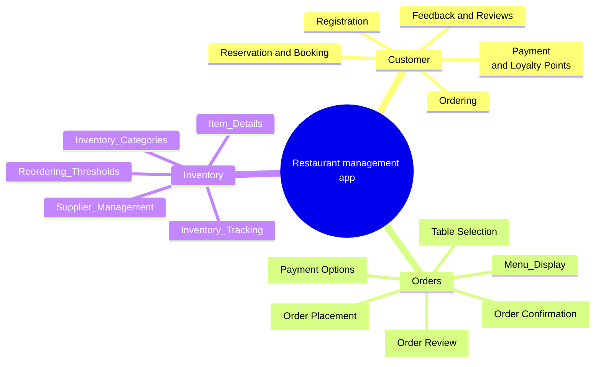

# Top Level Modules
Restaurant management app

Second Idea for restaurant app modules:

| **Module**                         | **Submodules/Functionalities**                                |
|-----------------------------------|--------------------------------------------------------------|
| **Customer Management Module**     | - Customer Registration                                      |
|                                   | - Reservation and Booking                                    |
|                                   | - Customer Profiles                                         |
|                                   | - Customer Loyalty Program                                 |
|                                   | - Feedback and Reviews                                     |
|                                   | - Customer Support                                         |
| **Order Management Module**        | - Order Placement                                           |
|                                   | - Menu Display                                             |
|                                   | - Table Selection (if applicable)                          |
|                                   | - Order Review                                             |
|                                   | - Order Confirmation                                       |
|                                   | - Payment Processing                                       |
|                                   | - Order Tracking                                           |
|                                   | - Kitchen Integration                                      |
|                                   | - Allergen and Dietary Information                         |
|                                   | - Order History                                            |
|                                   | - Promotions and Discounts                                 |
| **Inventory Management Module**    | - Inventory Item Management                                |
|                                   | - Supplier Management                                      |
|                                   | - Purchase Orders                                          |
|                                   | - Stock Tracking                                           |
|                                   | - Inventory Alerts (e.g., low stock)                        |
|                                   | - Expense Tracking                                         |
| **Kitchen Management Module**      | - Order Queue                                              |
|                                   | - Recipe Management                                        |
|                                   | - Food Preparation                                         |
|                                   | - Order Status Updates                                     |
|                                   | - Inventory Deductions                                     |
| **Table Management Module**        | - Table Reservations                                       |
|                                   | - Table Assignments                                        |
|                                   | - Table Status Tracking                                    |
| **Feedback and Reviews Module**    | - Customer Feedback Collection                             |
|                                   | - Review Management                                        |
|                                   | - Response Management                                      |
| **User and Staff Management Module**| - Staff and User Profiles                                 |
|                                   | - User Roles and Permissions                               |
|                                   | - Staff Scheduling (Shift Management)                       |
| **Promotions and Marketing Module** | - Promotion Campaigns                                      |
|                                   | - Marketing Analytics                                      |
|                                   | - Email and SMS Marketing                                  |
| **Analytics and Reporting Module** | - Sales Analytics                                          |
|                                   | - Customer Analytics                                       |
|                                   | - Inventory Analytics                                      |
|                                   | - Financial Reporting                                      |
| **Notification and Communication Module** | - Push Notifications                                  |
|                                          | - Email and SMS Notifications                           |
|                                          | - Order Updates                                         |
|                                          | - Promotions                                           |
| **Settings and Configuration Module**   | - Restaurant Settings                                  |
|                                          | - Payment Settings                                    |
|                                          | - Tax Settings                                        |
|                                          | - Menu Configuration                                  |
| **Security and Compliance Module**       | - User Authentication and Authorization                 |
|                                          | - Data Encryption                                     |
|                                          | - Compliance with Data Protection Regulations (e.g., GDPR) |
| **Offline Capability Module**            | - Ability to Function Without Internet Connectivity      |
